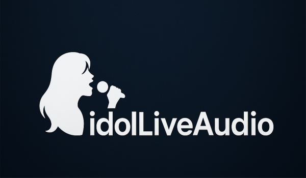
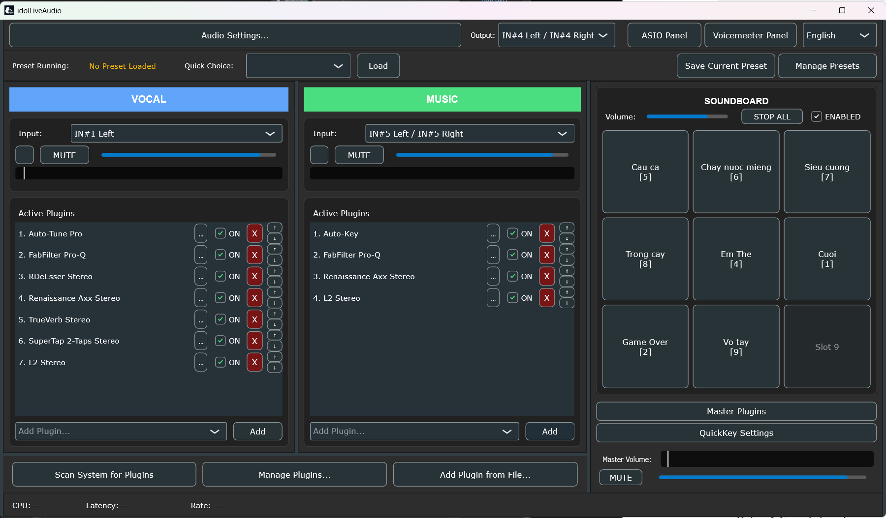

# idolLiveAudio

**Lightweight, open-source Audio Plugin Host for creators, singers, and streamers.**

> Built with the assistance of AI (Gemini + ChatGPT)  

---
## 🖥️ Screenshot

Lightweight, intuitive interface for managing plugins and soundboard during your live performances.

## 🚀 Key Features
✅ Supports Waves, Antares Auto-Tune Pro - Auto-key, and VST3 plugins  
✅ Realtime audio processing with low latency  
✅ Flexible plugin chain management per track  
✅ Soundboard with quick sound triggering  
✅ Simple, user-friendly interface  
✅ Developed with JUCE (C++20)  
✅ Open-source under GPLv3 license  

---

## 🌐 About idolLiveAudio

idolLiveAudio is designed to simplify professional audio processing for singers, streamers, and creators.  
It provides an easy-to-use plugin host with powerful features, allowing anyone to enhance their voice or music with high-end plugins.

This project demonstrates how AI tools like Gemini and ChatGPT can empower developers to build production-ready software, even without expert-level coding knowledge.

---

## 📦 Installation

**Option 1: Compile from Source**  
- Requires C++20 compatible compiler  
- Requires [JUCE Framework](https://juce.com)  
- Open `idolLiveAudio.jucer` with Projucer  
- Export to your preferred IDE (Visual Studio, Xcode, etc.)  
- Build and run  

**Option 2: Download Prebuilt Release**  
- Check the [Releases](https://github.com/DEVCodeWithAI/idolLiveAudio/releases) section  
- Download the latest `.zip` package  
- Extract and run the application  

---

## 🎬 Usage Instructions

- A full tutorial video will be provided soon.  
- Please visit the [Releases](https://github.com/DEVCodeWithAI/idolLiveAudio/releases) page to download the latest version.  
- Extract the `.zip` file and launch idolLiveAudio.  

---

### ⚠️ Important Notice for Waves Users:

If you have a large Waves plugin collection (e.g., Waves Ultimate or similar bundles), the initial plugin scan process can take significant time.  
This is normal! Do not close the application during scanning.  

**Estimated Scan Time:**  
- Small plugin set: a few seconds to 2 minutes  
- Large plugin set (Waves Ultimate): Up to 10-15 minutes  

✅ The scan only happens once. After completion, idolLiveAudio saves the results to a local file for faster future startups.  

---

### 🎧 Recommended Audio Setup

idolLiveAudio is designed for real-time audio processing. For the best experience, a dedicated external sound card with low-latency ASIO drivers is highly recommended.  

**If you don't have a professional sound card, we strongly suggest installing these free tools:**  
- [VB-Cable](https://vb-audio.com/Cable/) – Virtual audio cable  
- [ASIO4ALL](https://www.asio4all.org/) – Universal ASIO driver for low-latency audio  
- [Voicemeeter Banana](https://vb-audio.com/Voicemeeter/banana.htm) – Virtual mixer and routing software  

These tools help you achieve stable, low-latency audio processing even on regular computers without expensive hardware.  

---

## 🔊 Soundboard & Hotkey System

idolLiveAudio includes a Soundboard feature, allowing you to trigger sound effects or music clips quickly during your live sessions.  

**Current Limitations:**  
- Hotkeys for triggering soundboard actions only work while the idolLiveAudio window is focused (active).  

**Why no Global Hotkey yet?**  
- Global Hotkey support requires system-wide key capture, which many antivirus tools flag as suspicious behavior in unsigned software.  
- To protect idolLiveAudio's reputation and ensure user safety, Global Hotkey functionality will be added in future releases after we obtain a verified code signing certificate.  

---

## 💡 Contributing

We welcome community contributions!  
You can help by:  
- Reporting bugs  
- Suggesting features  
- Submitting pull requests  
- Sharing presets and configurations  

See [CONTRIBUTING.md](CONTRIBUTING.md) for details.

---

## ☕ Support the Project

We are self-funded. If you find idolLiveAudio useful or want to support future development, consider buying me a coffee:

👉 [https://buymeacoffee.com/devcodewithai](https://buymeacoffee.com/devcodewithai)

Your support helps cover development time and future plans like:  
✅ Dedicated website with full documentation  
✅ Community forum for technical support and preset sharing  
✅ Global Hotkey feature after software signing  
✅ Ongoing improvements and AI-driven features  

Thank you for supporting open-source and AI-assisted software development!

---
