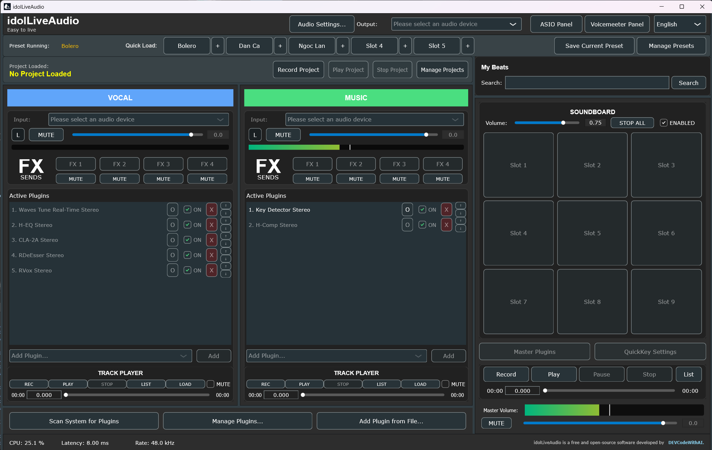

# idolLiveAudio (v1.1.0)

**Lightweight, open-source Audio Plugin Host for creators, singers, and streamers.**

> Built with the assistance of AI (Gemini), OpenAI (ChatGPT), and FFAI Framework (Meta Llama 3)

---

## 🌐 Languages

- [🇺🇸 English (default)](README.md)
- [🇻🇳 Tiếng Việt](README.vi.md)

---

## 🖥️ Screenshot

*A lightweight, intuitive interface for managing plugins and your soundboard during live performances.*

---

## ✨ What's New in v1.2.0: Beat Manager, UI Refresh & More

Version 1.2.0 builds on the Mini-DAW foundation, adding intelligent beat management, enhanced UI, and improved stability for live performance and creative workflows.

* **🎵 Beat Manager**:  
  A brand-new beat browsing and search interface with smart animation.  
  - Expand/collapse smoothly over the Soundboard area.  
  - Instantly filter beats by name with auto-suggest.  
  - Supports changing scan folder without affecting existing JSON indexes.

* **🎧 Dedicated FX Chains**:  
  Each track (Vocal & Music) has 4 FX Send slots for parallel reverb, delay, etc. — just like pro DAWs.

* **🎙 Per-Track Player & Recorder**:  
  Load audio files (e.g., backing tracks) directly into Vocal or Music tracks.  
  Record post-FX audio instantly for polished takes or creative ideas.

* **🧩 Multi-Track Project System**:
    * **Record Project (RAW)** – Simultaneous raw recording from Vocal and Music tracks.
    * **Manage Projects** – View, load, or delete multi-track sessions.
    * **Synchronized Playback** – Both raw tracks play in perfect sync.

* **🛡 Safety Lock System**:  
  Lock key settings to avoid accidental changes during a performance.

* **🧼 Bug Fixes & Improvements**:
    - Fixed ASIO Link Pro conflict when switching Presets.
    - Mute no longer prompts for saving Presets.
    - UI updated for better clarity and cleaner layout.

---

## 🚀 Key Features

✅ Supports Waves, Antares Auto-Tune Pro, and all VST3 plugins
✅ Real-time audio processing with low latency
✅ Flexible plugin chain management per track
✅ Dedicated FX Chains for parallel processing (Reverb, Delay, etc.)
✅ Integrated Player & Recorder for each track (Post-FX)
✅ Multi-Track Project System for recording raw, unprocessed audio
✅ Safety Lock to prevent accidental changes to core configurations
✅ Integrated Soundboard for quick sound triggering
✅ Simple, user-friendly interface
✅ Developed with JUCE (C++20)
✅ Open-source under the GPLv3 license

---

## 🗺️ Roadmap

### Current: The Soloist Edition (v1.1.0)

The current version is optimized for solo artists, streamers, and content creators, providing a complete toolset to professionally process one vocal track and one music track.

### Future: The Pro Edition

An **idolLiveAudio Pro** version is planned with advanced features for professional users:

* **Unlimited Tracks**: Support for an unlimited number of Vocal and Music tracks.
* **Deep Vendor Integration**: Enhanced compatibility and performance with plugins from major vendors.
* **Global Hotkeys**: Trigger actions in the application even when the window is not focused, supported by a secure code signing certificate.
* **License Management**: An integrated server login protocol to manage software licenses.

> **Projected Price for Pro Edition:** **$49 USD** for a perpetual license.

---

## 📦 Installation

**Option 1: Download Prebuilt Release (Recommended)**

* Visit the [**Releases**](https://github.com/DEVCodeWithAI/idolLiveAudio/releases) section for the latest version.
* Download the appropriate `.zip` package.
* Extract and run the application.

**Option 2: Compile from Source**

* Requires a C++20 compatible compiler.
* Requires the [JUCE Framework](https://juce.com).
* Open the `idolLiveAudio.jucer` file with the Projucer.
* Export the project to your preferred IDE (Visual Studio, Xcode, etc.).
* Build and run.

---

## ⚠️ Important Notice for Waves Users

If you have a large collection of Waves plugins (e.g., Waves Ultimate), the initial plugin scan can take a significant amount of time. **This is normal!** Please do not close the application during the scan.

* **Estimated Scan Time:**
    * Small plugin set: A few seconds to 2 minutes.
    * Large plugin set (Waves Ultimate): Up to 10-15 minutes.

✅ The scan only runs once. After completion, idolLiveAudio saves the results to a local file for much faster startups in the future.

---

## 🎧 Recommended Audio Setup

For the best experience, a dedicated external sound card with low-latency ASIO drivers is highly recommended.

**If you do not have a professional sound card, we strongly suggest installing these free tools:**

* [**VB-Cable**](https://vb-audio.com/Cable/) – Virtual audio cable.
* [**ASIO4ALL**](https://www.asio4all.org/) – Universal ASIO driver for low-latency audio.
* [**Voicemeeter Banana**](https://vb-audio.com/Voicemeeter/banana.htm) – Virtual audio mixer and routing software.

---

## 💡 Contributing

We welcome community contributions! You can help by:

* Reporting bugs.
* Suggesting features.
* Submitting pull requests.
* Sharing presets and configurations.

See [CONTRIBUTING.md](CONTRIBUTING.md) for more details.

---

## ☕ Support the Project

This project is self-funded. If you find idolLiveAudio useful, please consider supporting its development by buying me a coffee:

👉 [**https://buymeacoffee.com/devcodewithai**](https://buymeacoffee.com/devcodewithai)

Your support helps cover development time and future plans, including a dedicated website, a community forum, and advanced AI-driven features.